# Paperclip Agent Graph

Paperclip owns organization, assignments, durable issue state, budgets, run transcripts, routing, and human confirmation. The Python project owns provider adapters, normalization, scoring, evidence, and private application packets.

```mermaid
flowchart LR
    U["Board user sets search objective"] --> J["JobSpy board-isolated discovery"]
    J -->|"LinkedIn / Indeed results"| E["Employer URL resolution"]
    J -->|"Glassdoor / Zip 400 or 403"| CB["Open run circuit breaker"]
    J -->|"empty / error"| W["WebClaw missing-coverage search"]
    CB --> W
    W --> E["Employer URL resolution"]
    E -->|"board page unreadable"| AWB["AWB authenticated visible-text read"]
    AWB --> E
    E --> V{"WebClaw confirms active employer posting?"}
    V -->|"No"| X["Exclude before scoring"]
    V -->|"Yes"| A["Agent A: Recruiter handoff"]
    A -->|"verified job IDs"| B["Agent B: Match scorer + verifier"]
    B -->|"optional authorized ATS evidence"| M["Resume-Matcher preview"]
    M --> B
    B -->|"apply"| C["Agent C: Application Assistant"]
    B -->|"review"| U
    B -->|"skip"| X
    C --> P["Private application packet"]
    P --> G{"Paperclip confirmation accepted?"}
    G -->|"No / pending"| S["Stop safely"]
    G -->|"Yes, exact packet + action"| BU["browser-use exact-domain session"]
    BU --> F["Fill reviewed fields"]
    F --> SR{"Employer success receipt?"}
    SR -->|"Yes"| D["Mark applied"]
    SR -->|"No"| H["Save handoff + blocker"]
```

## Agent contracts

| Agent | Input | Local command | Output | External authority |
|---|---|---|---|---|
| A | Search objective and corrected resume | `agent-a-find`, then `agent-a` | Verified active employer URLs plus board/fallback diagnostics | Public discovery and verification only |
| B | Agent A verified job IDs | verified-only score; `agent-b`; optional Resume-Matcher | `apply`, `review`, or `skip` with deterministic and optional ATS evidence | Resume upload only after explicit service consent |
| C | Agent B `apply` IDs and reviewed candidate profile | `agent-c`, then `agent-c-browser` | Private packet, hash-bound receipt, plan, and verified outcome | Only after accepted confirmation for exact packet/action |

The agents are provisioned paused. This prevents assignments from starting model runs or external actions until the board user reviews the configuration and explicitly resumes the relevant agent.
